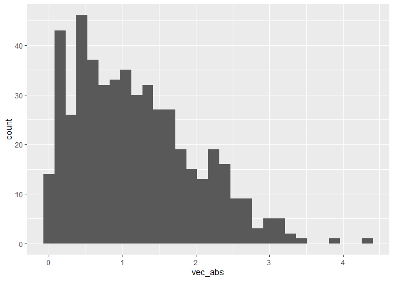

Introduction to R Markdown
================
Mari Sanders
2024-09-10

Loaded necessary packages (e.g. `tidyverse`)

I’m an R Markdown document!

# Section 1

Here’s a **code chunk** that samples from a *normal distribution*:

``` r
samp = rnorm(100)
length(samp)
```

    ## [1] 100

# Section 2

I can take the mean of the sample, too! The mean is -0.0068873.

# Learning Assessment

Creates a `test_frame` and plots a histogram

``` r
test_frame <- tibble(
  vec_numeric = rnorm(500, 1),
  vec_logical = vec_numeric > 0, 
  vec_abs = abs(vec_numeric)
)

ggplot(test_frame, aes(x = vec_abs)) + 
  geom_histogram()
```

<!-- -->

# Formatting

## Text formatting

*italic* or *italic*

**bold** or **bold**

`code`

superscript<sup>2</sup> and subscript<sub>2</sub>

## Headings

# 1st Level Header

## 2nd Level Header

### 3rd Level Header

## Lists

- Bulleted list item 1

- Item 2

  - Item 2a

  - Item 2b

1.  Numbered list item 1

2.  Item 2. The numbers are incremented automatically in the output.

## Tables

| First Header | Second Header |
|--------------|---------------|
| Content Cell | Content Cell  |
| Content Cell | Content Cell  |
